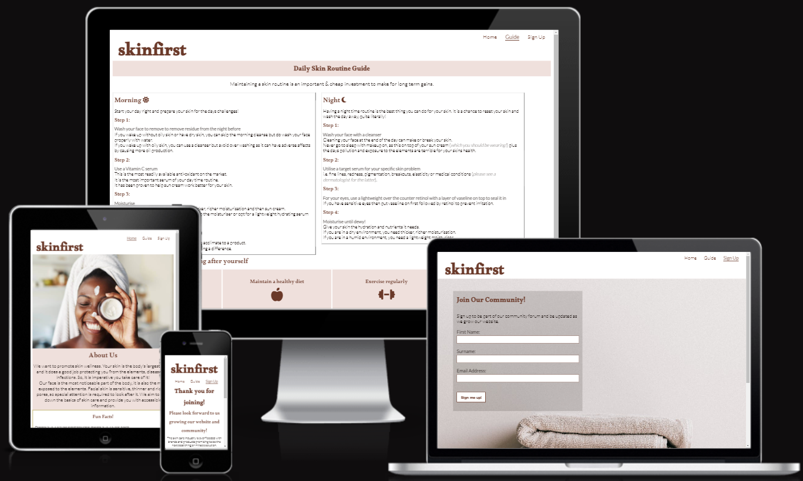

# skinfirst website

The skinfirst website is designed to promote skin wellness to its visitors. The purpose of the site is to provide the user with bitesize, accessible information that they can then apply in their day to day lives. 

There is an about us section, a daily routine guide and a sign up form which links to a thank you page when you sign up. The website is targeted towards people who want simplied information about what they can do to look after their skin.

[View skinfirst on Github Pages](https://sarohia94.github.io/Project-1-skinfirst/)

* [User Experience (UX)](#User-Experience-(UX))
  * [Initial Discussion](#Initial-Discussion)
  * [User Stories](#User-Stories)

* [Design](#Design)
  * [Colour Scheme](#Colour-Scheme)
  * [Typography](#Typography)
  * [Imagery](#Imagery)
  * [Wireframes](#Wireframes)
  * [Features](#Features)
  * [Accessibility](#Accessibility)

* [Technologies Used](#Technologies-Used)
  * [Languages Used](#Languages-Used)
  * [Frameworks, Libraries & Programs Used](#Frameworks,-Libraries-&-Programs-Used)

* [Deployment](#Deployment)
  * [GitHub Pages](#GitHub-Pages)

* [Testing](#Testing)
  * [W3C Validator](#W3C-Validator)
  * [Solved Bugs](#Solved-Bugs)
  * [Known Bugs](#Known-Bugs)
  * [Testing User Stories](#Testing-User-Stories)
  * [Lighthouse](#Lighthouse)
    * [Index Page](#Index-Page)
    * [Books Page](#Books-Page)
    * [Contact Us Page](#Contact-Us-Page)
    * [Thank You Page](#Thank-You-Page)
  * [Full Testing](#Full-Testing)
  
* [Credits](#Credits)
  * [Code Used](#Code-Used)
  * [Content](#Content)
  * [Media](#Media)
  * [Acknowledgments](#Acknowledgments)

- - -

## User Experience (UX)
### Initial Discussion

The skinfirst website looks to provide users with a guide, highlighting the importance of skin wellness and a simple to follow routine. The website will provide users with the option to sign up to join the community forum and be updated as we grow the webiste. 

#### Key information for the site

* What skinfirst is all about.
* Some facts related to skin.
* Suggestive guide for a Morning & Night routine.
* Other factors to consider to promote skin wellness.
* How to sign up and get involved.

### User Stories

#### Client Goals

* To make it responsive so that users are able to view the site on a range of device sizes.
* To make it easy for users to interact with the website intuitively.
* To make it simple for users to understand and follow the guidance being provided.
* To allow users to be able to sign up to skinfirst to get involved on the community forum and be kept informed as and when we update the website.

#### First Time Visitor Goals

* I want to find out what skinfirst is all about and what I can learn about skin wellness.
* I want to be able to navigate the site easily to find information.
* I want to be able to take away useful information that I can apply in my day to day life.

#### Returning Visitor Goals

* I want to find further, up to date information regarding skin wellness.
* I want to be able to contact and interact with skinfirst with questions and comments.

#### Frequent Visitor Goals

* I want to be able to interact and help build the community by leaving my own tips and sharing information on skin wellness.

- - -

## Design
### Colour Scheme
This was obtained from the [Coolors](https://coolors.co/) website.

### Typography

Google Fonts were used as below

* Alkalami is used for the headings. 

* Lato is used for the body of the text. It is a sans-serif font.

### Imagery

Images used are calming and natural to fit the theme and intention of the website. 

### Wireframes

Wireframes were created for destop/tablet and mobile.

* Home page wireframe can be found here for [desktop/tablet](docs/wireframes/skinfirstdesktop.png) and here for [mobile](docs/wireframes/skinfirstmobile.png).

* Guide page wireframe can be found here for [desktop/tablet](docs/wireframes/guidedesktop.png) and here for [mobile](docs/wireframes/guidemobile.png).

* Sign Up page wireframe can be found here for [desktop/tablet](docs/wireframes/signupdesktop.png) and here for [mobile](docs/wireframes/signupmobile.png).

---

## Features

* Responsive on a range of device sizes
* All pages on the website have:
  * A navigation bar on all three pages to make it easy for the user to navigate the website. This is uniform across all pages consisting of the logo to the left and the links to the home, guide and sign up pages to the right.
  * A footer centered at the bottom of all three pages with icon links to social media; Twitter, Facebook, Instagram & Youtube. The links open on to a new tab so the user does not leave the skinfirst website. As the intention for the website is to build a community the social media links are important to encourage interaction. 
* Home page
  * About us section will provide information to the user about the purpose of the website and what they can expect to learn.
  * Image of smiling woman (to the right on desktop/tablet and stacked on top on mobile) is used to set a warm, natural and welcoming aesthetic to the website. It also sets the tone on the feeling the website aims to inspire when visiting and thinking about skin wellness.
* Guide page
  * Morning and night routine section. This section will provide the user with a guide of routines they can follow for skin wellness and its benefits.
  * Other factors section. This will provide the user with other factors to consider such as lifestyle changes to promote skin wellness.
  * Responsible buying section. This will provide information to the user on what to look out for when purchasing products. This is to promote users into thinking about their purchasing power. This goes hand in hand in the postive thinking the website aims to inspire with skin wellness. As such, this section aims to further this with the consideration of enviornmental and societal impact.
* Sign Up page
  * Reasons on why the user will want to sign up.
  * A sign up form, which will require the user submit their full name and email address.
  * The sign up form will also have a text box where the user can submit a query, comment or feedback.
* Thank You page
  * A message thanking the user for signing up and a link to direct them back to the home page.

### Accessibility 
The website acheives accessibility with:
* Semantic HTML
* Alt attributes on the images
* Information provided for screen readers where icons are used with no text
* Colour contrast is checked and sufficient
* Marking current page as current for screen readers

---

## Technologies Used
### Languages Used
* HTML
* CSS

### Frameworks, Libraries & Programs Used
* Git - for version control. Using GitPod terminal to commit to Git and push to GitHub.
* GitHub - to save and store the code pushed from Git.
* Balsamic - to create the wireframes when designing the website.
* Google Fonts - to import font to apply on the website.
* Font Awesome - to add icons.
* Dev Tools - for testing and troubleshooting .
* Am I responsive? - to show website across a range of devices.
* Hover.css - to float the nav bar links.

---

## Deployment 
### GitHub Pages
The website was deployed to GitHub Pages as follows:
1. Log in to GitHub
2. Click on the "Settings" link for this Repository
3. Click on the "Pages" link on the left hand side of the page
4. Under "Source" select "Deploy from branch" from the dropdown
5. Under "Branch" select "main" from the dropdown
6. Click "Save" which will then refresh the page
7. It might take a few mins before you can refresh and view the link to the site published

---

## Testing 
* Issues faced before my mid project meeting:
  * 
* Issues raised in my mid project meeting with my mentor:
  * 
* Issues faced before submitting my project for review on slack:
  * 
* Issues raised as part of feedback from the peer code review on slack:
  * 
* Final issues raised following the end project meeting with my mentor:

### W3C Validator 

### Solved Bugs

### Known Bugs

### Testing User Stories

### Lighthouse

### Full Testing

---

## Credits

### Code

### Content
* The content was written by the developer Amritpreet Sarohia
* Icons used were taken from [Font Awesome](https://fontawesome.com/)
* Layout and structure of the README.md file was sampled from [Kera Cudmore's](https://github.com/kera-cudmore) template

### Media
Images used were obtained from the [Pexels](https://www.pexels.com/) webiste

### Acknowledgements 
Thank you to anyone taking the time to view my first project, to the Slack community and the below individuals:
* [Kera Cudmore](https://github.com/kera-cudmore) for her README webinar and resources provided
* [Chris Quinn](https://github.com/10xOXR)

