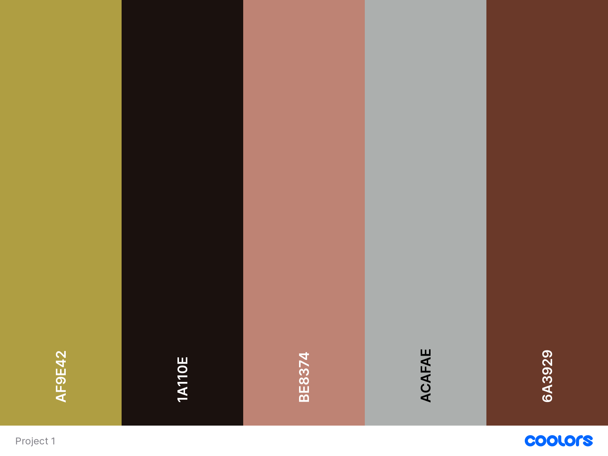
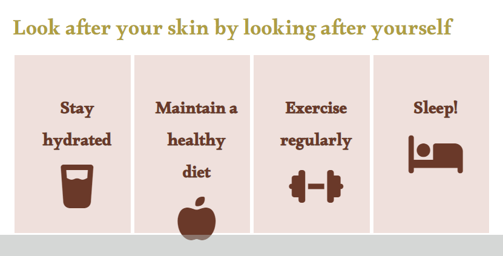
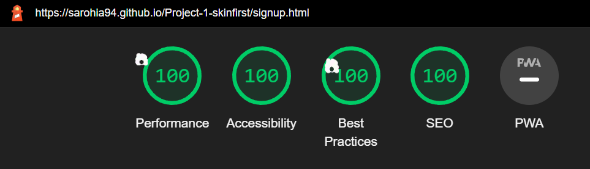

# skinfirst website

The skinfirst website is designed to promote skin wellness to its visitors. The purpose of the site is to provide the user with bitesize, accessible information that they can then apply in their day to day lives. 

There is an about us section, a daily routine guide and a sign up form which links to a thank you page when you sign up. The website is targeted towards people who want simplified information about what they can do to look after their skin.

[View skinfirst on Github Pages](https://sarohia94.github.io/Project-1-skinfirst/)

* [User Experience (UX)](#User-Experience-(UX))
  * [Initial Discussion](#Initial-Discussion)
  * [User Stories](#User-Stories)

* [Design](#Design)
  * [Colour Scheme](#Colour-Scheme)
  * [Typography](#Typography)
  * [Imagery](#Imagery)
  * [Wireframes](#Wireframes)
  * [Features](#Features)
  * [Accessibility](#Accessibility)

* [Technologies Used](#Technologies-Used)
  * [Languages Used](#Languages-Used)
  * [Frameworks, Libraries & Programs Used](#Frameworks,-Libraries-&-Programs-Used)

* [Testing](#Testing)
  * [W3C Validator](#W3C-Validator)
  * [Solved Bugs](#Solved-Bugs)
  * [Known Bugs](#Known-Bugs)
  * [Testing User Stories](#Testing-User-Stories)
  * [Lighthouse](#Lighthouse)
    * [Index Page](#Index-Page)
    * [Books Page](#Books-Page)
    * [Contact Us Page](#Contact-Us-Page)
    * [Thank You Page](#Thank-You-Page)
  * [Full Testing](#Full-Testing)

  * [Deployment](#Deployment)
    * [Local Deployment](#Local-Deployment)
      * [How to Clone](How-to-Clone)
      * [How to Fork](How-to-fork)
    * [Remote Deployment](#Remote-Deployment)
  
* [Credits](#Credits)
  * [Code Used](#Code-Used)
  * [Content](#Content)
  * [Media](#Media)
  * [Acknowledgments](#Acknowledgments)

- - -

## User Experience (UX)

### Initial Discussion

The skinfirst website looks to provide users with a guide, highlighting the importance of skin wellness and a simple to follow routine. The website will provide users with the option to sign up to join the community and be updated as we grow the website. 

#### Key information for the site:

* What skinfirst is all about.
* Some facts related to skin.
* A guide for a morning & night routine.
* Other factors to consider to promote skin wellness.
* How to sign up and get involved.

### User Stories

#### Client Goals

* To make it responsive so that users are able to view the site on a range of device sizes.
* To make it easy for users to interact with the website intuitively.
* To make it easy for users to understand and follow the guidance being provided.
* To allow users to be able to sign up to skinfirst to get involved in the community we are trying to build and be kept informed as and when we update the website.

#### First Time Visitor Goals

* I want to find out what skinfirst is all about and what I can learn about skin wellness.
* I want to be able to navigate the site easily to find information.
* I want to be able to take away useful information that I can apply in my day to day life.
* I want to be able connect with skinfirst via social media links.

#### Returning Visitor Goals

* I want to find further, up to date information regarding skin wellness.
* I want to be able to contact and interact with skinfirst with questions and comments.

#### Frequent Visitor Goals

* I want to be able to interact and help build the community by leaving my own tips and sharing information on skin wellness.

- - -

## Design

### Colour Scheme
This was obtained from the [Coolors](https://coolors.co/) website.

### Typography

Google Fonts were used as below:

* Alkalami is used for the headings. 

* Lato is used for the body of the text. It is a sans-serif font.

### Imagery

Images used are purposefully warm and natural to fit the theme and intention of the website. Images were taken from the [Pexels](https://www.pexels.com/) website and can be found in the credits section.

### Wireframes

Wireframes were created for destop/tablet and mobile.

* Home page wireframe can be found here for [desktop/tablet](docs/wireframes/skinfirstdesktop.png) and here for [mobile](docs/wireframes/skinfirstmobile.png).

* Guide page wireframe can be found here for [desktop/tablet](docs/wireframes/guidedesktop.png) and here for [mobile](docs/wireframes/guidemobile.png).

* Sign Up page wireframe can be found here for [desktop/tablet](docs/wireframes/signupdesktop.png) and here for [mobile](docs/wireframes/signupmobile.png).

---

## Features

* Responsive on a range of device sizes
* All pages on the website have:
  * A navigation bar on all three pages to make it easy for the user to navigate the website. This is uniform across all pages consisting of the logo to the left and the links to the home, guide and sign up pages to the right. Hovering over the links emboldens the the text and has an underline which remains once clicked on to highlight which page the user is currently on.
  * A footer centered at the bottom of all three pages with icon links to social media; Twitter, Facebook, Instagram & Youtube. The links open on to a new tab so the user does not leave the skinfirst website. As part of the intention for the website is to build a community, the social media links are important to encourage interaction. Hovering over the link increases the icon size to make it interactive.
* Home page
  * About us section will provide information to the user about the purpose of the website, some context on skin care and what they can expect to learn.
  * Image of a smiling woman (to the right on desktop and stacked on top on mobile/tablet) is used to set a warm, natural and welcoming aesthetic to the website. It also sets the tone on the feeling the website aims to inspire when visiting and thinking about skin wellness.
  * Fun facts aside to provide some interesting skin related information.
* Guide page
  * Morning and night routine. This section will provide the user with an easy to follow guide for skin wellness, with some rationale.
  * Other factors section. This will provide the user with other factors to consider such as lifestyle changes to promote skin wellness.
* Sign Up page
  * A reason on why the user will want to sign up, to be updated as we grow the website and to join the community which will later become an interactive forum with other members.
  * A sign up form, which will require the user to submit their full name and email address.
* Thank You page
  * A message thanking the user for signing up with a note reiterating our websites intention and a 30 second timer with a button too, to direct them back to the home page.
* Future features
  * Responsible buying section on the guide page. This will provide information to the user on what to look out for when purchasing products. This is to promote users into thinking about their purchasing power. This goes hand in hand with the postive thinking the website aims to inspire with skin wellness. As such, this section would further this with the consideration of societal & environmental benefits of using certain accredited skin care products.
  * Add links to the other factors section, making the text or icons clickable, to direct users to related articles or video content providing futher information on the benefits.
  * The sign up form can have a text box where the user can submit a query, comment or feedback. The other option to further this is to have a link to another page which acts as a interactive community forum for ideas to be shared and discussed amongst members.
  
### Accessibility 
The website achieves accessibility with:
* Semantic HTML
* Alt attribute on the image
* Information provided for screen readers where icons are used with no text
* Colour contrast, checked and sufficient
* Marking current page as current for screen readers

---

## Technologies Used

### Languages Used
* HTML
* CSS

### Frameworks, Libraries & Programs Used
* Git - for version control. Using GitPod terminal to commit to Git and push to GitHub.
* GitHub - to save and store the code pushed from Git.
* Balsamic - to create the wireframes when designing the website.
* [Google Fonts](https://fonts.google.com/) - to import font to apply on the website.
* [Font Awesome](https://fontawesome.com/) - to add icons.
* Dev Tools - for testing and troubleshooting.
* [Am I responsive?](https://ui.dev/amiresponsive) - to show website across a range of devices.
* [Wave](https://wave.webaim.org/) - to test web accessibility.
* [W3C](https://validator.w3.org/) - HTML validator.
* [Jigsaw](https://jigsaw.w3.org/css-validator/) - CSS validator.
* Hover.css - to make the nav bar, footer links and the sign up button interactive.
* [Tiny PNG](https://tinypng.com/) - to compress images.
* [Responsive design checker](https://responsivedesignchecker.com/) - to check responsive design for a variety of screen sizes.
* [Favicon.io](https://favicon.io/favicon-generator/) - to creat favicon icon for the website.
---

## Testing 
* Issues raised in my mid project meeting with my mentor:
  1. Layout used for bigger screen sizes on home page looked a little awkward so we discussed using the mobile landing image for all screen sizes but image was too pixelated. Using flex box to create a 3 column view seemed to improve the layout structure for screen sizes up to 1440px.
  
  2. Remove "/" infront of the file paths, as relative path should be used for the images.
  3. Add meta tag for http-equiv, to the thankyou page to direct the user automatically back to the home page after a set time. Mentor [Chris Quinn](https://github.com/10xOXR) has been credited for the code. However, doing so showed as an issue by lowering the lighthouse accessibility score. To combat this I extended the time from 10s to 30s to allow for more reading and decision making time for the user on how to navigate away from the thankyou page. There is also a note left on the thankyou page warning the user they will be directed to the home page in 30s.
  
* Issues faced before submitting my project for review on Slack:
  1. I have tested my website on mobile, tablet and desktop. I have tested on Samsung internet, Chrome and Microsoft Edge but need futher testing on different browsers.
* Issues raised as part of feedback from the peer code review on slack:
  1. The nav bar had a white background on all pages but the signup page. This was resolved after applying flex box to the body element. This was identified by [Lane-Sawyer Thompson](https://github.com/LaneSawyerT).
  
  2. Issue with day and night routine not being centered on bigger screen sizes, resulting in a larger gap on the right. This was resolved by floating left the morning routine and floating right the night routine, setting the width as 45%. This was identified by [Anya McDonald](https://github.com/anyahush).
  
  3. Issue with the footer not sticking to the bottom of the page and as such leaving a gap. This was resolved by using flex box on the body and setting a margin top on the footer. The code for this was obtained from [here](https://dev.to/nehalahmadkhan/how-to-make-footer-stick-to-bottom-of-web-page-3i14). This was identified by [Anya McDonald](https://github.com/anyahush).
  4. Issue with the hover effect on the social media icons. Where all icons would react when you are switching between the links. This was identified by [Anya McDonald](https://github.com/anyahush). I had tried playing around with the code to target the icons but I was unable to resolve this. Mentor [Chris Quinn](https://github.com/10xOXR), suggested applying the transition styling with 0.3s and ease-in-out. This seemed to have improved the jumping effect on the icons.
  
* Final issues raised following the end project meeting with my mentor:
  1. Mentor [Chris Quinn](https://github.com/10xOXR) suggested that a Favicon icon would be a nice addition to the webpage. This was applied by creating the design and following the instructions from [Favicon.io](https://favicon.io/favicon-generator/) website.

### W3C Validator 
No issues with the HTML pages or CSS:
* [index.html](docs/testing/w3c/w3chtmlindex.png)
* [guide.html](docs/testing/w3c/w3chtmlguide.png)
* [signup.html](docs/testing/w3c/w3chtmlsignup.png)
* [thankyou.html](docs/testing/w3c/w3chtmlthankyou.png)
* [css](docs/testing/w3c/w3ccss.png)

### Solved Bugs
Issues faced and resolved before my mid project meeting:
  1. Adding media queries to make website pages responsive. Initially started by building with the desktop view in mind so lost time when reworking to build mobile first as discussed with my mentor in our first project meeting.
  2. Struggled to make my landing images responsive and proportional. Using specificity on the image tag and setting the height, width and object-fit seemed to resolve the issue.
  
  
  3. The other factors section would break on smaller screen sizes due to the size of the icons in proportion the box. This was resolved by have the boxes stacked on top of each other for smaller screen sizes and amending the padding.
  
  4. Lighthouse and colour contrast check on [Coolers](https://coolors.co/contrast-checker/af9e42-ffffff) showed poor accessibility for font colour #AF9E42 against white or light coloured backgrounds so this was amended to #6A3929.
  
  5. Below error message appeared due to an alt attribute being included in the source tag which was not required. Looking in to this further with tutor [Gemma Sayers](https://github.com/GJSayers) on Slack it seems for now nothing more can be done for accessibility using the source tag.
  

### Known Bugs
  1. On screen sizes 1600px and upwards there is increasingly free space below the about us and fun facts aside. Another media query can be added to reconfigure the layout or add further content in these sections such as videos. Due to time constaints this may be something to be worked on and improved later.
  

### Testing User Stories
* First Time Visitors
  * I want to find out what skinfirst is all about and what I can learn about skin wellness.
  
  * I want to be able to navigate the site easily to find information. Current page will be shown with text emoboldened and an underline. Hovering over any of the other nav bar links will also cause the text to embolden and an underline to appear.
  
  * I want to be able to take away useful information that I can apply in my day to day life.
  
  * I want to be able connect with skinfirst via social media links. Hovering over the icons will cause the size to increase.
  
  
* Returning Visitors
  * I want to be able to contact and interact with skinfirst.
  

* Frequent Visitor Goals
  * I want to be able to interact and help build the community by leaving my own tips and sharing information on skin wellness. This will be feature to add down the line to make the site more interactive. This can be in the form of a text area field or a separate page for a community forum section.

### Lighthouse
* Index page testing for mobile

* Index page testing for desktop

* Guide page testing for mobile

* Guide page testing for desktop

* Signup page testing for mobile

* Signup page testing for desktop

* Thankyou page testing for mobile

* Thankyou page testing for desktop

### Manual Testing
* Tested responsiveness with the different dimensions in dev tools and via [Responsive design checker](https://responsivedesignchecker.com/).
* Tested website on mobile with [Chrome](docs/testing/manualtesting/chromemobile.jpg) & [Samsung internet](docs/testing/manualtesting/samsunginternetmobile.jpg)
* Tested on tablet with [Amazon Silk browser](docs/testing/manualtesting/amazonsilkbrowsertablet.png), laptop with [Microsoft Edge](docs/testing/manualtesting/microsoftedgelaptop.png) and desktop with [Microsoft Edge](docs/testing/manualtesting/microsoftedgedesktop.png).
* Tested via peer review on mobile with Safari and on desktop with Mozilla Firefox, thanks to [Lane-Sawyer Thompson](https://github.com/LaneSawyerT).
* Tested nav links and logo link.
* Tested social media link. They open on to a new page as expected.
* Tested sign up form. Fields left blank will flag up when attempting to sign up.
* Tested thankyou page. No action for 30s will automatically redirect you back to the home page. Clicking on the button before the timer will also send you back to the home page.

---

## Deployment 

### Local Deployment

#### How to Clone
1. Sign up or log in to GitHub
2. Go to the repository https://github.com/Sarohia94/Project-1-skinfirst 
3. Go to the code dropdown and select how you'd like clone and copy the link provided
4. Go to the new repo and enter in your workspace terminal, "git clone" followed by the link copied

#### How to Fork
1. Sign up or log in to GitHub
2. Go to the repository https://github.com/Sarohia94/Project-1-skinfirst 
3. Click on the fork button towards the top right of the page 

### Remote Deployment
The website was deployed to GitHub Pages as follows:
1. Log in to GitHub
2. Assuming you have cloned or forked the repository, go on the "Settings" link for this repository
3. Click on the "Pages" link on the left hand side of the page
4. Under "Source" select "Deploy from branch" from the dropdown
5. Under "Branch" select "main" from the dropdown
6. Click "Save" which will then refresh the page
7. It might take a few mins before you can refresh and view the link to the site published

---

## Credits

### Code
* Meta tag for http-equiv credited to my mentor [Chris Quinn](https://github.com/10xOXR) following mid project meeting.
* How to make the footer stick to the bottom of the page credited to [DEV](https://dev.to/nehalahmadkhan/how-to-make-footer-stick-to-bottom-of-web-page-3i14) post.
* Transition effect styling to the social media icons credited to my mentor [Chris Quinn](https://github.com/10xOXR) following end project meeting.
* Favicon icon and link tags code from [Favicon.io](https://favicon.io/favicon-generator/) webiste.

### Content
* The content was written by the developer Amritpreet Sarohia.
* Icons used were taken from [Font Awesome](https://fontawesome.com/)
* Fun facts aside from [here](https://forefrontdermatology.com/skin-fun-facts)
* Daily routine guide and inspiration from [here](https://www.youtube.com/watch?v=PSoDYzw-iUI)  
* Layout and structure of the README.md file was sampled from the Code Institute and [Kera Cudmore's](https://github.com/kera-cudmore) template.

### Media
Images used were obtained from the [Pexels](https://www.pexels.com/) website.

### Acknowledgements 
Thank you to anyone taking the time to view my first project, to the Slack community, the tutors and the below individuals:
* [Chris Quinn](https://github.com/10xOXR), my mentor. Thank you for your guidance and feedback.
* [Kera Cudmore](https://github.com/kera-cudmore) for her README webinar and resources provided.
* [Lane-Sawyer Thompson](https://github.com/LaneSawyerT) for his feedback on slack as part of the peer review.
* [Anya McDonald](https://github.com/anyahush) for her feedback on slack as part of the peer review.
* [Gemma Sayers](https://github.com/GJSayers) for her assistance on Slack.